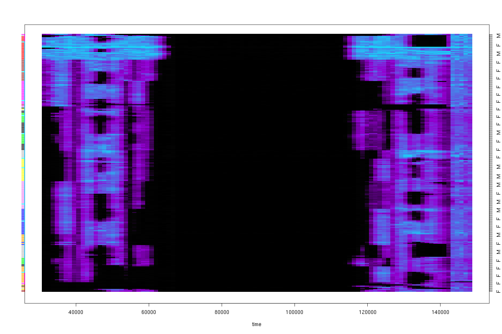

# Visualisation of the evolution of ego-centered community structure using temporal personalised pagerank

At first, we say that a ego-community structure is a probability
measure defined on the set of network nodes. Any subset of nodes may
engender its own ego-community structure around. Many community
detection algorithms can be modified to yield a result of this type,
for instance, the personalized pagerank.

Next, we present a continuous version of Viard-Latapy-Magnien link
streams (defined
[here](https://hal.archives-ouvertes.fr/hal-01112627v4/document)),
that we call "temporal density". Classical kernel density estimation
is used to move from discrete link streams to their continuous
counterparts. Using matrix perturbation theory we can prove that
ego-community structure changes smoothly when the network evolves
smoothly. This is very important, for example, for visualization
purposes.

Combining the temporal density and personalized pagerank methods, we
are able to visualize and study the evolution of the ego-community
structures of complex networks with a large number of temporal links.

We illustrate and validate our approach using "Primary school temporal
network data" provided by sociopatterns.org.

The lines in the following image corresponds to the students.  A
column at the timestamp _t_ is the ego-community structure around one
school student _Υ_, selected in advance as a center of the community.
Red means _in the community of Υ_, blue means _out the community of Υ_.

See also : [Slides](http://kirgizov.link/talks/ccs-2016.pdf)